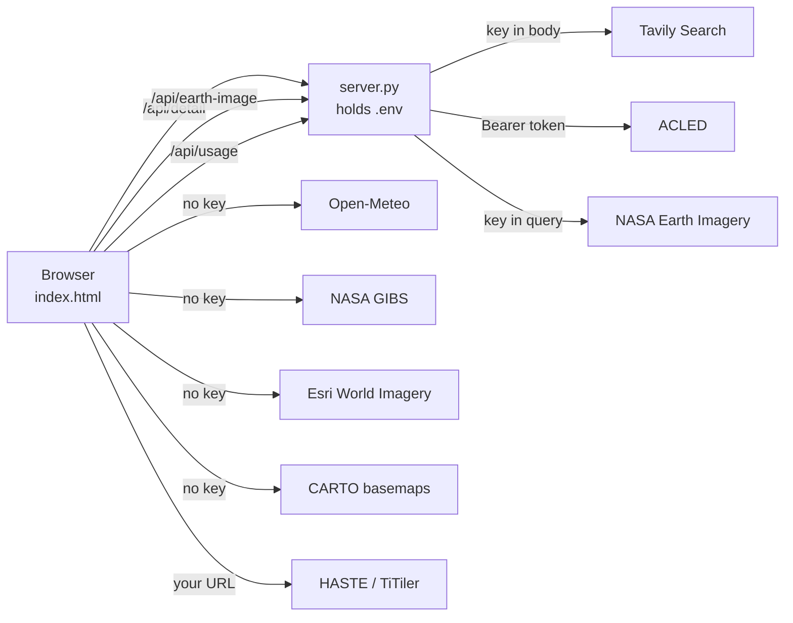

# How the Evacuation Inform Index Talks to the Outside World

A complete guide to every external service this project calls, why each one is
called from where it is, and what happens when any of them is missing.

If you only read one section, read [At a glance](#at-a-glance) and
[Setting up your keys](#setting-up-your-keys).

---

## At a glance

Nine external services, plus one dataset that is baked in rather than fetched.

| Service | What it provides | Auth | Called from | Cost |
|---|---|---|---|---|
| Tavily Search | Recent news per crisis | API key | Server | 1 credit per search |
| ACLED | Dated conflict events and fatalities | OAuth2 password grant | Server | Free tier |
| NASA Earth Imagery | Landsat snapshot for one point | API key | Server | Free |
| Open-Meteo | Route weather and daylight | None | Browser | Free |
| NASA GIBS | Daily satellite basemaps (VIIRS, MODIS) | None | Browser | Free |
| Esri World Imagery | High resolution zoomable satellite | None | Browser | Free |
| CARTO basemaps | Reference map tiles | None | Browser | Free |
| unpkg | Leaflet 1.9.4 library and stylesheet | None | Browser | Free |
| Microsoft HASTE | AI building and route damage tiles | None, self hosted | Browser | Your own deployment |
| INFORM Severity Index | The 104 crisis scores | None | Not fetched, see below | Free |

INFORM is the exception. It is not an API call at all: the April 2026 release
was downloaded from HDX and committed to `data.js` as a static array. The map
works with no network access to ACAPS and no key. Refreshing it is a manual
step, which is why the header states the release date.

---

## The one design rule

Everything else follows from a single decision:

> A service that needs a secret is called by the server. A service that needs
> no secret is called directly by the browser.

There is no build step, no bundler, and no framework. `index.html` is served as
a plain file, so any key placed in client JavaScript would be readable by
anyone who opens the page. Tavily, ACLED and NASA therefore sit behind
`server.py`, which holds the credentials and returns only the processed result.

Open-Meteo, GIBS, Esri and CARTO need no credential, so routing them through
the server would add a hop and a failure point for nothing. They are called
straight from the page.



A consequence worth knowing: when the site is hosted on GitHub Pages there is
no `server.py`, so the three server backed features fall back to a stored
snapshot. See [Running without a server](#running-without-a-server).

---

## Server side integrations

These three run inside `server.py`. Credentials come from a gitignored `.env`
and never reach the browser.

### 1. Tavily Search, live news

```
POST https://api.tavily.com/search
```

The key travels in the JSON body, not a header. For each crisis the server
builds a query from the country and crisis name and asks for news only:

| Field | Value |
|---|---|
| `topic` | `news` |
| `days` | 30 to 365, chosen by the Time window control |
| `max_results` | 10 |
| `include_answer` | `true`, giving a one paragraph synthesis |
| `search_depth` | `basic`, the cheaper of the two tiers |

Each result is reduced to title, URL, published date, a snippet capped at 260
characters, and the source domain. Nothing else is stored.

Tavily bills per search, not per token, so one uncached crisis click costs one
credit. This is the only integration that costs money as you browse, which is
why usage tracking exists at all. Watch your balance at `app.tavily.com`.

### 2. ACLED, the conflict timeline

ACLED migrated to OAuth2 in 2025. The old `api.acleddata.com` endpoint that
took a key and email in the query string is deprecated and is not used here.

Two steps:

```
POST https://acleddata.com/oauth/token      -> Bearer token, valid 24h
GET  https://acleddata.com/api/acled/read   -> events, with Authorization header
```

The token request is form encoded with `grant_type=password`,
`client_id=acled` and `scope=authenticated`. The returned token is held in
memory and also written to `.cache/acled_token.json`, so restarting the server
does not trigger a fresh login. It is treated as expired 120 seconds early to
avoid using a token that dies mid request.

The read call requests only three fields, `event_date`, `event_type` and
`fatalities`, and pages through results 5000 at a time up to 30 pages. Events
are bucketed by month into a timeline, with totals by event type.

Two behaviours are worth understanding, because they look like bugs and are
not:

Access tier embargo. Many ACLED accounts serve only data older than about
twelve months. The API reports this in `data_query_restrictions.date_recency`,
and the server surfaces it as a note rather than silently showing a timeline
that stops a year ago. If your conflict chart ends well before today, this is
why, and no code change will fix it. Tavily covers the recent window instead.

Country name mismatches. INFORM and ACLED disagree on country names, so
`ACLED_ALIAS` in `server.py` maps between them, for example "DRC" to
"Democratic Republic of Congo". A crisis returning zero events is often a
missing alias rather than an absence of conflict.

### 3. NASA Earth Imagery, the location snapshot

```
GET https://api.nasa.gov/planetary/earth/imagery?lat=&lon=&dim=&api_key=
```

Proxied through `/api/earth-image` purely to keep the key server side. The
response is image bytes rather than JSON, so the proxy caches the PNG on disk
for seven days; the upstream endpoint is slow and the imagery rarely changes.

If NASA returns something that is not an image, which it does for locations
with no Landsat coverage, the proxy returns JSON with an error and the page
hides the image element rather than showing a broken frame.

---

## Browser side integrations

No keys, called directly from `index.html`.

### 4. Open-Meteo, route weather

```
GET https://api.open-meteo.com/v1/forecast
```

Requests current temperature, precipitation, wind speed and weather code, plus
today's sunrise and sunset, with `timezone=auto`.

This is the only live input that changes a score. Bad weather subtracts points
from the CERAI feasibility figure, on the reasoning that a storm narrows the
window in which people can actually move. Daylight hours are computed from the
sunrise and sunset pair and displayed alongside.

### 5. NASA GIBS, daily satellite basemaps

```
https://gibs.earthdata.nasa.gov/wmts/epsg3857/best/<PRODUCT>/default/<DATE>/GoogleMapsCompatible_Level9/{z}/{y}/{x}.jpg
```

Two products are offered as toggleable layers, `VIIRS_SNPP_CorrectedReflectance_TrueColor`
and `MODIS_Terra_CorrectedReflectance_TrueColor`. These are daily true colour
composites, useful for weather systems and large scale events, not for
building level detail.

### 6. Esri World Imagery, high resolution

```
https://server.arcgisonline.com/ArcGIS/rest/services/World_Imagery/MapServer/tile/{z}/{y}/{x}
```

Note the tile order: Esri uses `{z}/{y}/{x}`, where most XYZ services use
`{z}/{x}/{y}`. Getting this wrong yields a map that loads tiles from the wrong
place rather than an obvious error.

This is the layer the "inspect imagery" action flies to when you want to look
at an actual location at zoom 14 and beyond.

### 7. CARTO, the reference basemap

The default light basemap, used so that crisis markers stay readable against a
muted background.

### 8. unpkg, the mapping library

Leaflet 1.9.4, loaded as a stylesheet and a script from the CDN. This is the
project's only third party JavaScript dependency. There is no `package.json`
and no `node_modules`.

### 9. Microsoft HASTE, damage assessment

Optional, and the only integration you must stand up yourself. HASTE has no
public API. You run it, produce a damage layer for a disaster area, and paste
its TiTiler tile URL into the Map tab. The URL is kept in `localStorage`.

The interface reports the real state of the connection rather than assuming
it. It requests tiles, turns green only once tiles actually arrive, reports
failure when none do, and distinguishes partial coverage, which is normal since
TiTiler serves nothing outside its project area, from total failure. It also
refuses an `http://` tile URL when the page itself is on HTTPS, because the
browser would block those tiles as mixed content.

Full instructions are in [HASTE_SETUP.md](HASTE_SETUP.md).

---

## Setting up your keys

```bash
cp .env.example .env
```

Then fill in four values. `.env` is gitignored and must stay that way.

| Variable | Needed for | Where to get it |
|---|---|---|
| `TAVILY_API_KEY` | Live news | Free key at https://app.tavily.com, begins `tvly-` |
| `ACLED_EMAIL` | Conflict timeline | The email you registered at https://acleddata.com/register |
| `ACLED_PASSWORD` | Conflict timeline | Your ACLED account password, not an API key |
| `NASA_API_KEY` | Location snapshot | Free key at https://api.nasa.gov |

The ACLED pair is the one people get wrong. Since the 2025 OAuth2 migration
the API authenticates with your account password, and the older
`ACLED_API_KEY` value does nothing. If you have an old `.env` carrying that
variable, it is inert and can be removed.

Every key is optional. Start the server with none of them and the map, scores,
weather and satellite layers all still work; only the three server backed
panels go quiet, each reporting which key is missing rather than failing
silently.

```bash
python3 server.py       # then open http://localhost:8000
```

---

## The server's own endpoints

`server.py` serves the static files and adds three routes.

### `GET /api/detail`

The main one. Returns news and conflict timeline for a single crisis.

| Parameter | Meaning |
|---|---|
| `crisis` | Crisis name, matching `data.js` |
| `country` | Country name, matching `data.js` |
| `days` | Lookback window, clamped to between 1 and 365 |
| `nocache` | Present to force a live fetch and bypass the cache |

The response always includes a `keys` object saying which credentials were
present and an `errors` array naming anything that failed. A missing key is
reported, never disguised.

### `GET /api/earth-image`

Takes `lat`, `lon` and optional `dim`, returns a PNG or a JSON error.

### `GET /api/usage`

Returns billable call counts, both cumulative and for the current process, so
you can see what you have spent without opening the Tavily dashboard.

---

## Caching and cost control

Three layers, because the only metered service is Tavily.

Response cache. Every `/api/detail` result is written to `.cache/` keyed by a
hash of crisis, country, window and which keys were present, and reused for six
hours. Clicking the same crisis repeatedly within that window costs nothing.

Image cache. NASA PNGs are held for seven days.

Token cache. The ACLED bearer token is reused for its full 24 hour life.

Only genuine outbound calls increment the counters in `.cache/usage.json`.
Cache hits are free and are not counted, so the number reflects real spend.

---

## Running without a server

GitHub Pages serves static files and cannot run Python, so the three server
backed features would break there. Instead, `snapshot.py` replays the real
Tavily and ACLED calls for all 104 crises and writes the results to
`snapshot/detail/<slug>.json`.

The page tries the live endpoint first and falls back to the stored file, so
the hosted site still shows news and a conflict timeline, labelled as a
snapshot so nobody mistakes captured data for live data.

```bash
python3 snapshot.py            # fill in missing crises, resumable
python3 snapshot.py --force    # regenerate all 104
```

The slug function in `snapshot.py` must stay identical to `detailSlug()` in
`index.html`. If they drift, every lookup misses and the fallback silently
stops working.

Weather remains live in this mode, since Open-Meteo is called from the browser
and needs no server.

---

## When something looks wrong

| Symptom | Most likely cause |
|---|---|
| News panel empty, "no_tavily_key" | `TAVILY_API_KEY` unset or malformed |
| News panel empty, key is set | Monthly Tavily credits exhausted |
| Conflict timeline empty | Country name has no `ACLED_ALIAS` entry |
| Timeline stops about a year ago | Your ACLED access tier's recency embargo, not a bug |
| ACLED auth fails | Using `ACLED_API_KEY` instead of `ACLED_PASSWORD` |
| Satellite snapshot missing | `NASA_API_KEY` unset, or no Landsat coverage there |
| Damage overlay red | HASTE not running, wrong URL, or mixed content blocked |
| Everything stale, "Snapshot" label | Expected on GitHub Pages, run `server.py` for live data |

---

## Adding another service

The existing code answers most of the question by example, but the decisions
worth making deliberately are:

Does it need a secret? If yes it belongs in `server.py`, reached through a new
`/api/` route, and its key belongs in `load_env()`. If no, call it from
`index.html` and skip the hop.

Does it cost money per call? If yes, wrap it with `cache_get` and `cache_set`
and call `usage_bump` only on real outbound requests.

What happens when it is absent? Append to the `errors` array and let the page
hide the feature. The established practice throughout this project is that a
gap in evidence is shown as a gap, never as a zero and never as silence.
